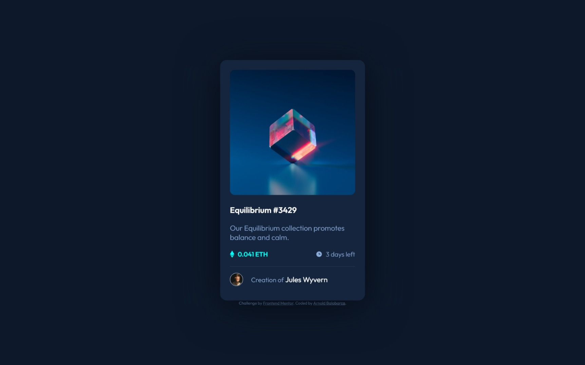

# Frontend Mentor - QR code component solution

This is a solution to the [NFT preview card component challenge on Frontend Mentor](https://www.frontendmentor.io/challenges/nft-preview-card-component-SbdUL_w0U). Frontend Mentor challenges help you improve your coding skills by building realistic projects. 

## Table of contents


- [Overview](#overview)
  - [Screenshot](#screenshot)
  - [Links](#links)
- [My process](#my-process)
  - [Built with](#built-with)
  - [What I learned](#what-i-learned)
  - [Useful resources](#useful-resources)
- [Author](#author)

## Overview

### Screenshot




### Links

- Solution URL: [GitHub](https://github.com/arn28/nft-preview-card-component)
- Live Site URL: [Vercel](https://qr-code-component-eta-eight.vercel.app/)

## My process

### Built with

- HTML box model
- Flexbox
- Mobile-first workflow

### What I learned

After making the HTML structure, I started by linking the font families and creating some global variables for  color.
I set propierties box-sizing: border-box;, setting marging and padding to 0, so I can set the size and margin of elements easily.
Also, I set some proprieties by default such as font-family.
I used flexbox and its properties to organize the elements and make them responsive.
For the active state I used the ':hover' selector and 'opacity' property for making the element appear and disappear:
```css
    .container .nftImage .view{
      position: absolute;
      opacity: 0;
      top: 0;
      background-color: rgba(0, 255, 247, 0.5);
      height: 99%;
      width: 100%;
      border-radius: 8px; 
      cursor: pointer;
    }

    .container .nftImage .view:hover{
      opacity: 1;  
    }
```


### Useful resources

- [HTML box model](https://www.w3schools.com/css/css_boxmodel.asp) - This helped me undertanding the boc moddel we have to follow at maketing a web site.

- [CSS flexbox](https://css-tricks.com/snippets/css/a-guide-to-flexbox/) - This is an amazing guide which helped me finally understand Flexbox properties. I'd recommend it to anyone still learning this concept.

## Author

- Github - [Arnold Balabarca](https://github.com/arn28)
- Frontend Mentor - [@arn28](https://www.frontendmentor.io/profile/arn28)

